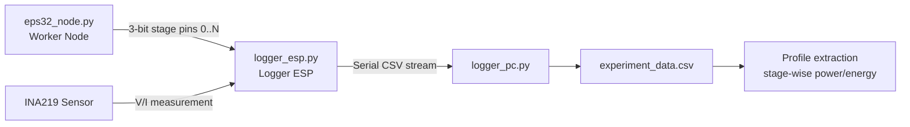
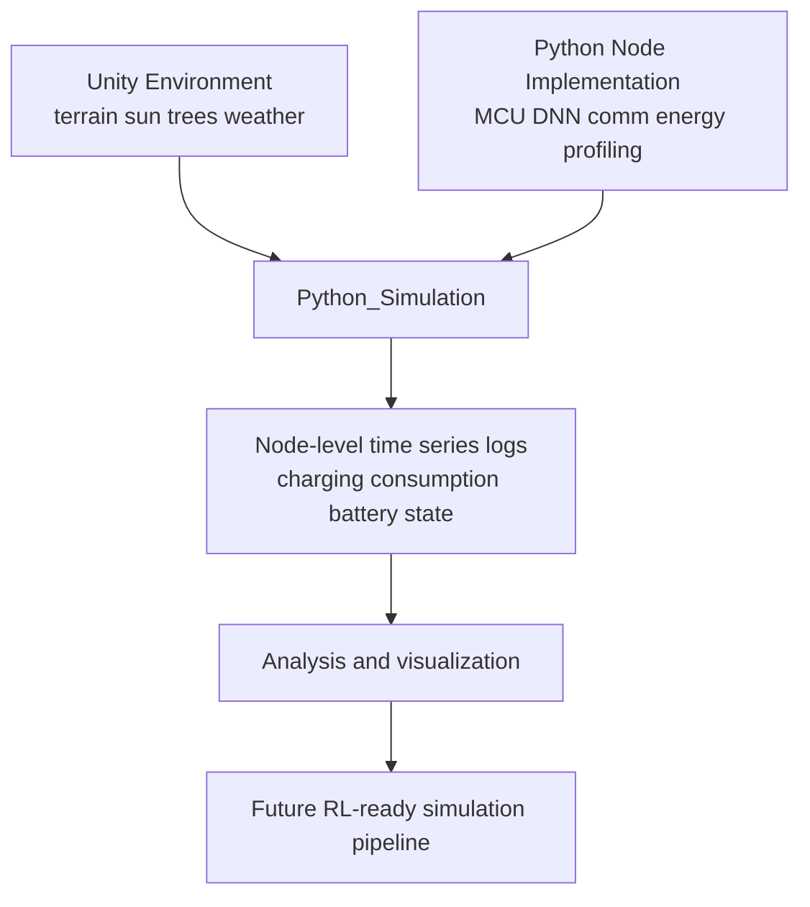

# DSES Dynamic Sensing Environment Simulation

이 프로젝트는 다음 목적을 가집니다.

"WSN simulation with a focus on modeling natural environmental dynamics, including weather, solar radiation, and time-varying conditions"

핵심 아이디어는 Unity의 물리/환경 시뮬레이션 강점을 기반으로, 실제 배포 환경에 가까운 자연 조건(시간, 태양, 지형, 차광, 기상 변화)이 WSN 노드 동작과 에너지 흐름에 미치는 영향을 모델링하는 것입니다.

또한 실제 Deploy 환경 모사를 강화하기 위해, 사용하는 하드웨어/코드(DNN 모델, 통신 코드, 에너지 입력량)의 에너지 사용량을 프로파일링하고 이를 시뮬레이션 파이프라인에 반영해 정확도를 높입니다.

## Repository Structure

이 저장소는 크게 3개 파트로 구성됩니다.

1. Unity DSES Simulatrion
2. Python Node Implementation
3. Python_Simulation

---

## 1) Unity DSES Simulatrion

Unity 기반 시뮬레이션 환경 생성 파트입니다. 지형 정보, Node 및 각종 객체 위치, 시간에 따른 태양 위치, 비/기상 변화, 그리고 그에 따른 차광(그늘) 계산에 필요한 정보를 제공합니다.

- 폴더: [Unity DSES Simulatrion](Unity%20DSES%20Simulatrion)
- 실행 시 기대 데이터:
  - Terrain(지형)
  - Node 및 객체 위치
  - 시간 기반 Sun 위치
  - 기상(예: 비) 기반 환경 변화
  - 차광(그늘) 계산용 환경 정보

현재 상태(중요):

- 현재는 해(Sun), 지형(Terrain), 나무(Tree) 정보를 중심으로 구성되어 있습니다.

필수 애셋:

- UniStorm 유료 애셋이 필요합니다.
- 링크: [UniStorm (Unity Asset Store)](https://assetstore.unity.com/packages/tools/particles-effects/unistorm-volumetric-clouds-sky-modular-weather-and-cloud-shadows-2714?srsltid=AfmBOoq_2J94vN_nJbQd9XCzmWdTYz525zuS1-7uOnWlsg--Sl2_GXVi)

---

## 2) Python Node Implementation

실제 배포 환경에 가깝게 MCU/통신/모델 실행을 반복 수행하여, 대상 HW의 에너지 사용 프로파일을 생성하는 파트입니다.

- 폴더: [Python Node Implementation](Python%20Node%20Implementation)
- 하위 파트:
  - [algorithm_simulation](Python%20Node%20Implementation/algorithm_simulation)
  - [mcu_profiling](Python%20Node%20Implementation/mcu_profiling)
  - 수집 코드: [collecting](Python%20Node%20Implementation/mcu_profiling/collecting)

### 2-1) mcu_profiling/collecting 개요

INA219 같은 모듈을 사용해 DC 전압/전류를 측정하고, 이를 에너지 프로파일 생성에 사용합니다.

- 실제 동작 노드 코드: [eps32_node.py](Python%20Node%20Implementation/mcu_profiling/collecting/eps32_node.py)
- Logger는 별도의 1개 ESP에서 실행되어 측정/기록을 담당
- eps32_node는 각 단계(stage)마다 지정 핀으로 0~N 상태(코드상 3-bit 상태값)를 출력
- Logger는 해당 상태값과 INA219 측정값을 결합해, 각 stage별 에너지 사용량을 계산 가능

### 2-2) collecting 파일별 역할

- [eps32_node.py](Python%20Node%20Implementation/mcu_profiling/collecting/eps32_node.py)
  - ESP32-C3에서 센싱/연산/통신 워크로드를 상태별로 수행
  - 3-bit 핀 신호로 현재 상태(Idle, Node0~4, TX, Sensing)를 외부 Logger에 전달
  - 센서(I2C/MPU9250/초음파) 및 ESP-NOW 송신 흐름 포함

- [logger_esp.py](Python%20Node%20Implementation/mcu_profiling/collecting/logger_esp.py)
  - 별도 ESP 보드에서 INA219 전압/전류 측정
  - Worker 보드의 3-bit 상태 핀 입력을 읽어 mode 재구성
  - CSV 형태 시리얼 로그(Time, Voltage, Current, Power, Mode) 출력

- [logger_pc.py](Python%20Node%20Implementation/mcu_profiling/collecting/logger_pc.py)
  - PC에서 시리얼 포트를 읽어 CSV 파일로 저장
  - Logger ESP 출력 로그를 실험 데이터로 아카이빙

- [ina219_driver.py](Python%20Node%20Implementation/mcu_profiling/collecting/ina219_driver.py)
  - MicroPython용 INA219 드라이버
  - 버스전압/전류 측정 및 보정(calibration) 처리

- [model_train_n_profile.py](Python%20Node%20Implementation/mcu_profiling/collecting/model_train_n_profile.py)
  - DNN(ResNet10/DS-CNN) 정의 및 TFLite 변환/크기-연산량 프로파일링

- [simulator.py](Python%20Node%20Implementation/mcu_profiling/collecting/simulator.py)
  - 모델/통신 시나리오별 에너지-정확도 트레이드오프 비교 시뮬레이션
  - Single Tiny / Distributed / Raw TX baseline 비교 시각화

### 2-3) algorithm_simulation

- 폴더: [algorithm_simulation](Python%20Node%20Implementation/algorithm_simulation)
- Node에 탑재할 DNN 관련 실험 코드 파트입니다.
- 현재는 견본(샘플) 성격의 구현입니다.

### 2-4) 동작 흐름 시각화

---

## 3) Python_Simulation

Unity에서 추출된 지형/태양 정보와 MCU/센서 프로파일 정보를 바탕으로, N시간 동안의 차광/충전/소비 시뮬레이션을 수행하고 저장/기록/시각화합니다.

- 폴더: [Python_Simulation](Python_Simulation)

주요 스크립트:

- [generate_24h_simulation.py](Python_Simulation/generate_24h_simulation.py)
  - 24시간(주/야간) 태양 고도/방위 및 나무 기반 그림자 영향 계산
  - 노드별 irradiance_multiplier 계산
  - 충전률(charging_rate_mw), 소비전력(power_consumption_mw), 배터리 잔량(battery_joules, battery_pct), 노드 상태(node_state)를 시간축으로 기록
  - 결과 CSV 저장: exports/latest/node_simulation_log.csv

- [battery_option_scenarios.py](Python_Simulation/battery_option_scenarios.py)
  - 다양한 배터리 용량 시나리오(예: 10~1000mAh) 반복 시뮬레이션
  - deep sleep 비율, 고갈/부활 시점, 최종 잔량 등 비교 통계 생성

- [node_profiling_spec.md](Python_Simulation/node_profiling_spec.md)
  - 상태별 전력, 배터리/충전 정책 등 시뮬레이션 스펙 문서

---

## End-to-End Data Flow

---

## TODO

### Unity DSES Simulatrion

- 나무 Mesh 정보가 실제 태양 Ray 계산(차광 계산)에 정확히 반영되는지 검증 필요

### Python Node Implementation

- 전력/에너지 사용량 측정의 디테일 강화 필요
- ESP32-C3 Mini 외 다양한 칩/하드웨어에서도 일관된 프로파일링 가능하도록 일반화 필요

### Python_Simulation

- Sun 정보 중심에서 확장하여 바람(Wind) 등 추가 환경 인자를 기록/생성/반영하도록 확장 필요
- 현재 시뮬레이션 결과를 기반으로 향후 RL 학습이 가능하도록 파이프라인 고도화 예정
