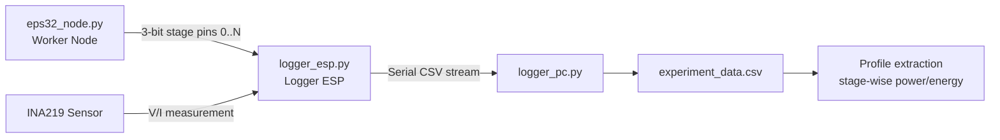
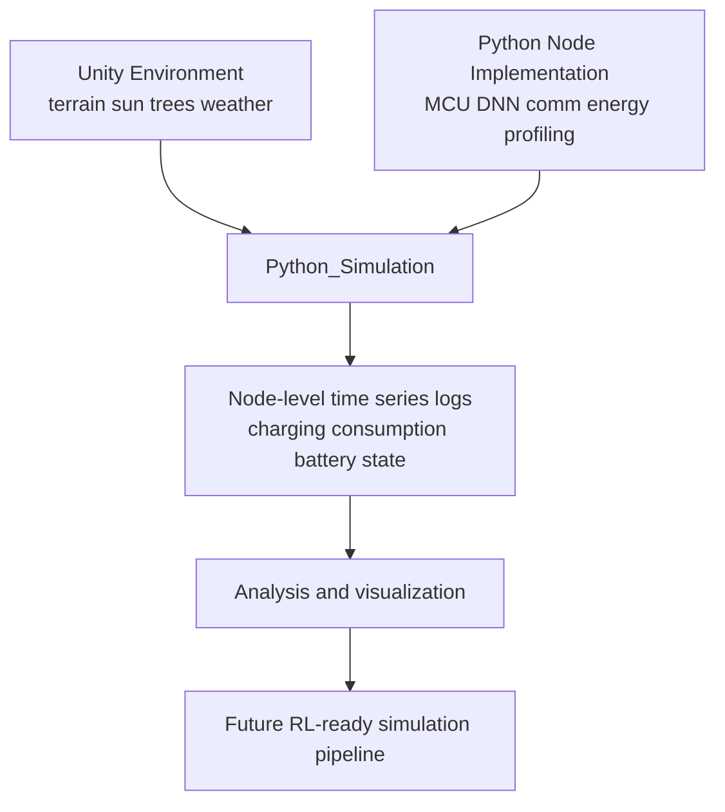

# DSES Dynamic Sensing Environment Simulation

This project has the following goal:

"WSN simulation with a focus on modeling natural environmental dynamics, including weather, solar radiation, and time-varying conditions"

The core idea is to leverage Unity's strengths in physics and environmental simulation to model how realistic natural conditions (time, sun position, terrain, shading, and weather changes) affect WSN node behavior and energy flow.

To improve realism for deployment environments, the project also profiles energy consumption from the actual hardware and code paths (DNN models, communication code, and energy input conditions) and reflects those profiles in the simulation pipeline.

## Repository Structure

This repository is organized into three main parts:

1. Unity DSES Simulatrion
2. Python Node Implementation
3. Python_Simulation

---

## 1) Unity DSES Simulatrion

This is the Unity-based environment generation part of the project. It provides terrain data, node/object positions, time-dependent sun position, rain/weather changes, and the information needed for shading calculations.

- 폴더: [Unity DSES Simulatrion](Unity%20DSES%20Simulatrion)
- Runtime outputs include:
  - Terrain information
  - Node and object positions
  - Time-based sun position
  - Weather-driven environmental changes (e.g., rain)
  - Data for shading and shadow computation

Current status (important):

- The current environment is mainly built around sun, terrain, and tree data.

Required asset:

- UniStorm is required and must be purchased.
- Link: [UniStorm (Unity Asset Store)](https://assetstore.unity.com/packages/tools/particles-effects/unistorm-volumetric-clouds-sky-modular-weather-and-cloud-shadows-2714?srsltid=AfmBOoq_2J94vN_nJbQd9XCzmWdTYz525zuS1-7uOnWlsg--Sl2_GXVi)

---

## 2) Python Node Implementation

This part repeatedly executes MCU workloads, communication, and model inference to generate realistic energy-consumption profiles for the target hardware under deployment-like conditions.

- 폴더: [Python Node Implementation](Python%20Node%20Implementation)
- Subfolders:
  - [algorithm_simulation](Python%20Node%20Implementation/algorithm_simulation)
  - [mcu_profiling](Python%20Node%20Implementation/mcu_profiling)
  - Collection scripts: [collecting](Python%20Node%20Implementation/mcu_profiling/collecting)

### 2-1) Overview of mcu_profiling/collecting

It uses modules such as INA219 to measure DC voltage/current and uses those measurements to build energy profiles.

- Actual running node code: [eps32_node.py](Python%20Node%20Implementation/mcu_profiling/collecting/eps32_node.py)
- The loggers run on a separate ESP board dedicated to measurement/logging.
- eps32_node sends stage information (0..N, implemented as 3-bit states in code) through designated pins.
- The logger combines stage states with INA219 measurements to estimate stage-wise energy usage.

### 2-2) Role of each collecting file

- [eps32_node.py](Python%20Node%20Implementation/mcu_profiling/collecting/eps32_node.py)
  - Runs sensing/compute/communication workloads by state on ESP32-C3
  - Sends current state (Idle, Node0~4, TX, Sensing) to the external logger via 3-bit pins
  - Includes sensor flows (I2C/MPU9250/ultrasonic) and ESP-NOW transmission

- [logger_esp.py](Python%20Node%20Implementation/mcu_profiling/collecting/logger_esp.py)
  - Measures INA219 voltage/current on a dedicated ESP logger board
  - Reconstructs mode by reading 3-bit state pins from the worker board
  - Outputs serial logs in CSV format (Time, Voltage, Current, Power, Mode)

- [logger_pc.py](Python%20Node%20Implementation/mcu_profiling/collecting/logger_pc.py)
  - Reads serial data on PC and stores it as CSV
  - Archives logger ESP outputs as experiment datasets

- [ina219_driver.py](Python%20Node%20Implementation/mcu_profiling/collecting/ina219_driver.py)
  - INA219 driver for MicroPython
  - Handles bus voltage/current reading and calibration

- [model_train_n_profile.py](Python%20Node%20Implementation/mcu_profiling/collecting/model_train_n_profile.py)
  - Defines DNN models (ResNet10/DS-CNN), converts to TFLite, and profiles model size/compute cost

- [simulator.py](Python%20Node%20Implementation/mcu_profiling/collecting/simulator.py)
  - Simulates energy-accuracy tradeoffs across model/communication scenarios
  - Visualizes comparison of Single Tiny / Distributed / Raw TX baselines

### 2-3) algorithm_simulation

- 폴더: [algorithm_simulation](Python%20Node%20Implementation/algorithm_simulation)
- Experimental DNN code intended for node-side deployment.
- Currently provided as a reference/sample implementation.

### 2-4) Workflow visualization

---

## 3) Python_Simulation

Using terrain/sun data exported from Unity and MCU/sensor profiling data, this module runs N-hour simulations for shading, charging, and consumption, then stores, logs, and visualizes results.

- 폴더: [Python_Simulation](Python_Simulation)

Main scripts:

- [generate_24h_simulation.py](Python_Simulation/generate_24h_simulation.py)
  - Computes 24-hour (day/night) sun elevation/azimuth and tree-based shadow effects
  - Computes node-level irradiance multipliers
  - Records time-series outputs: charging_rate_mw, power_consumption_mw, battery_joules, battery_pct, node_state
  - Saves result CSV: exports/latest/node_simulation_log.csv

- [battery_option_scenarios.py](Python_Simulation/battery_option_scenarios.py)
  - Repeats simulations across battery capacities (e.g., 10~1000mAh)
  - Produces comparative statistics such as deep sleep ratio, depletion/revival timing, and final battery levels

- [node_profiling_spec.md](Python_Simulation/node_profiling_spec.md)
  - Simulation specification for state-wise power, battery policy, and charging policy

---

## End-to-End Data Flow

---

## TODO

### Unity DSES Simulatrion

- Verify whether tree mesh information is correctly reflected in actual sun-ray (shadow) calculations.

### Python Node Implementation

- Improve the detail and precision of power/energy measurement.
- Generalize profiling so it remains consistent across hardware beyond ESP32-C3 Mini.

### Python_Simulation

- Extend beyond sun-only factors to include additional environmental variables such as wind.
- Evolve the pipeline so the simulation can be used for future RL training.
